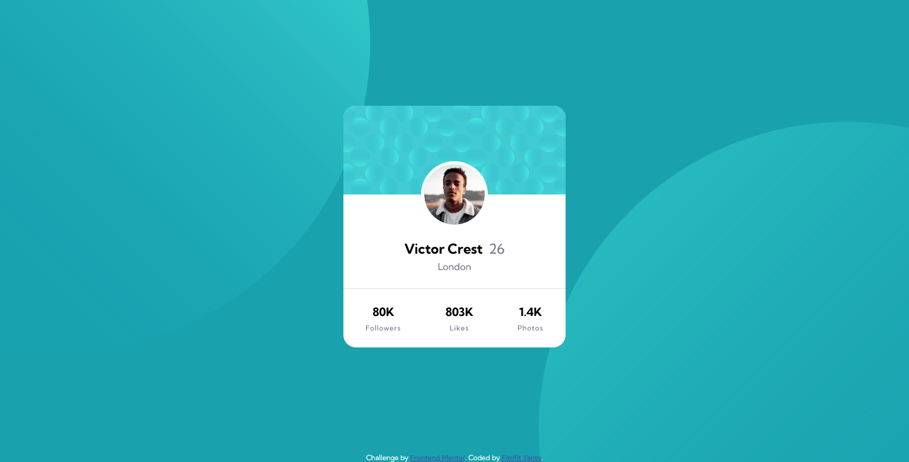

# Frontend Mentor - Profile card component solution

Hi all :wave: , this is the 5th challenge I completed. This is a solution to the [Profile card component challenge on Frontend Mentor](https://www.frontendmentor.io/challenges/profile-card-component-cfArpWshJ). Frontend Mentor challenges help you improve your coding skills by building realistic projects. 

## Table of contents
- [Frontend Mentor - Profile card component solution](#frontend-mentor---profile-card-component-solution)
  - [Table of contents](#table-of-contents)
  - [Overview](#overview)
    - [The challenge](#the-challenge)
    - [Screenshot](#screenshot)
    - [Links](#links)
  - [My process](#my-process)
    - [Built with](#built-with)
    - [What I learned](#what-i-learned)
    - [Useful resources](#useful-resources)
  - [Author](#author)
  - [Acknowledgments](#acknowledgments)

## Overview

### The challenge

- Build out the project to the designs provided

### Screenshot



### Links

- Solution URL: [Solution](https://www.frontendmentor.io/solutions/profile-card-component-using-html-css-ryJ9JEcSq)
- Live Site URL: [Preview](https://fitrifityanto.github.io/frontendmentor-projects/profile-card-component-main/mysolution.html)

## My process

### Built with

- Semantic HTML5 markup
- CSS custom properties
- Flexbox

### What I learned

In this challenge, in the design provided there are two background images. This is my first time working on a case that requires setting the position of the background image. At first I found it difficult. whether to use one value, two values, then how to determine how many percent, or how many px or vw/vh or whatever.
After some trial and error, and finally found a way to get results close to the design.

Here's the code I applied:

```css
    background: url('images/bg-pattern-top.svg'), 
                url('images/bg-pattern-bottom.svg'), 
                var(--cbg-body-dark-cyan);
    background-repeat:  no-repeat, no-repeat;  
    background-position: bottom 40vh right 50vw, top 49vh left 51vw;
```

I use four-value ​​to determine the position of the background image. I placed a 40vh background image from the bottom of the container and 50vw from the right.

here there are two backgrounds, so the writing is separated by a comma.

### Useful resources

- [background-position by Chris Coyier (CSS-Tricks)](https://css-tricks.com/almanac/properties/b/background-position/) 

## Author

- Github - [@fitrifityanto](https://github.com/fitrifityanto)
- Frontend Mentor - [@fitrifityanto](https://www.frontendmentor.io/profile/fitrifityanto)
- Twitter - [@fitrifityanto](https://www.twitter.com/fitrifityanto)

## Acknowledgments

I am very grateful to anyone who is willing to provide feedback for me so that I can further improve my coding skills