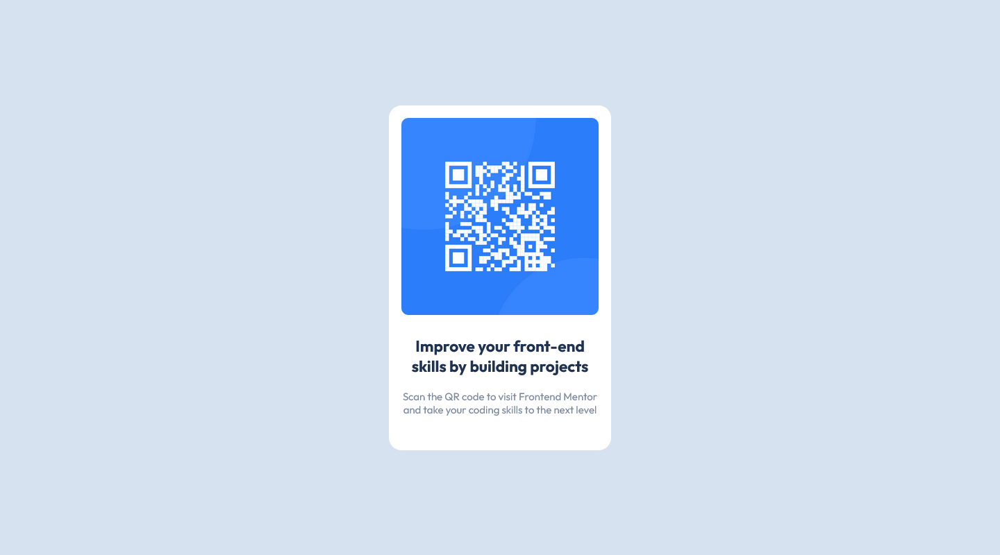

# Frontend Mentor - QR code component solution

This is a solution to the [QR code component challenge on Frontend Mentor](https://www.frontendmentor.io/challenges/qr-code-component-iux_sIO_H). Frontend Mentor challenges help you improve your coding skills by building realistic projects. 

## Table of contents

- [Frontend Mentor - QR code component solution](#frontend-mentor---qr-code-component-solution)
  - [Table of contents](#table-of-contents)
  - [Overview](#overview)
    - [Screenshot](#screenshot)
    - [Links](#links)
  - [My process](#my-process)
    - [Built with](#built-with)
    - [What I learned](#what-i-learned)
    - [Useful resources](#useful-resources)
  - [Author](#author)
  - [Acknowledgments](#acknowledgments)


## Overview

### Screenshot




### Links

- Solution URL: [Add solution URL here](https://your-solution-url.com)
- Live Site URL: [Add live site URL here](https://your-live-site-url.com)

## My process

### Built with

- Semantic HTML5 markup
- Flexbox


### What I learned

I saw the design, the components were in the middle of the area, so i decided to use flexbox layout on the wrapper, which is the `.wrapper` class.

To see how you can add code snippets, see below:

```css
.wrapper {
    display: flex;
    justify-content: center;
    align-items: center;
    background-color: var(--color-light-gray);
}
```

### Useful resources

- [Kevin Powell](https://www.youtube.com/channel/UCJZv4d5rbIKd4QHMPkcABCw) - This is Kevin Powell's youtube channel, on this channel I learn a lot about CSS.


## Author

- Frontend Mentor - [@fitrifityanto](https://www.frontendmentor.io/profile/fitrifityanto)
- Twitter - [@fitrifityanto](https://www.twitter.com/fitrifityanto)


## Acknowledgments

This is my first project on the Mentor frontend, so I thank those of you who are willing to provide input or opinions about my coding to improve my coding skills ^_^.


