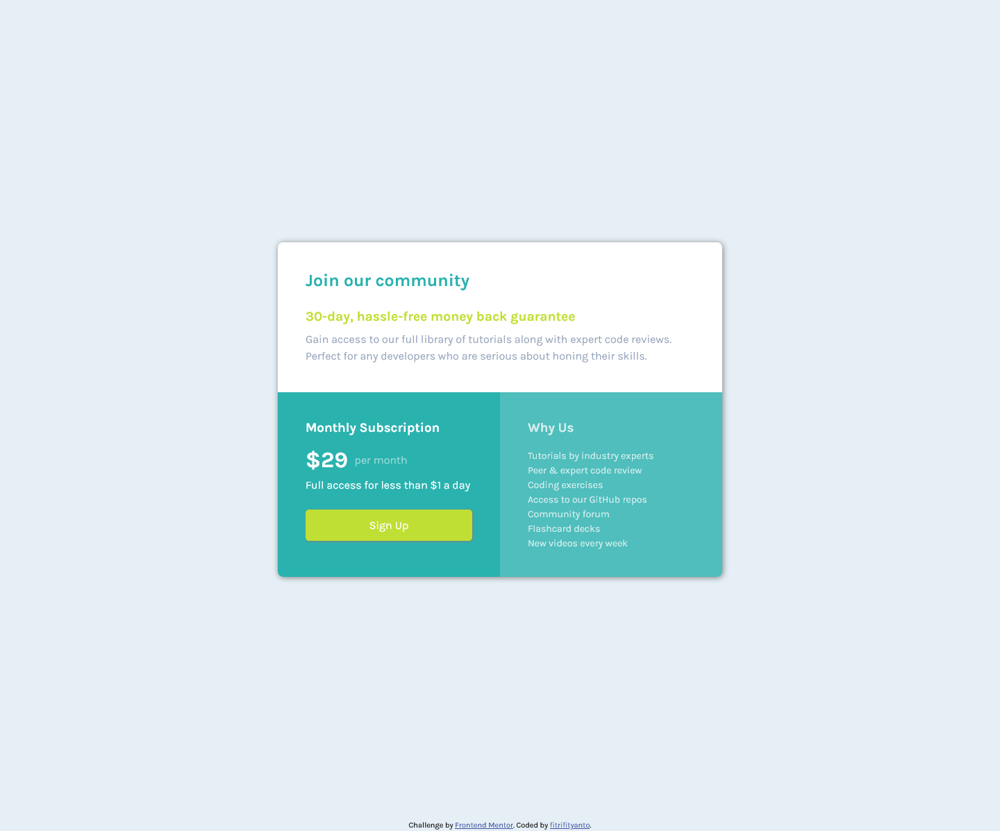

# Frontend Mentor - Single price grid component solution

Hi all :wave: , this is the 7th challenge I completed. This is a solution to the [Single price grid component challenge on Frontend Mentor](https://www.frontendmentor.io/challenges/single-price-grid-component-5ce41129d0ff452fec5abbbc). Frontend Mentor challenges help you improve your coding skills by building realistic projects. 

## Table of contents
- [Frontend Mentor - Single price grid component solution](#frontend-mentor---single-price-grid-component-solution)
  - [Table of contents](#table-of-contents)
  - [Overview](#overview)
    - [The challenge](#the-challenge)
    - [Screenshot](#screenshot)
    - [Links](#links)
  - [My process](#my-process)
    - [Built with](#built-with)
    - [What I learned](#what-i-learned)
    - [Useful resources](#useful-resources)
  - [Author](#author)
  - [Acknowledgments](#acknowledgments)

## Overview

### The challenge

- Build out the project to the designs provided

### Screenshot



### Links

- Solution URL: [Solution](https://www.frontendmentor.io/solutions/single-price-grid-component-using-css-grid-HkKb4rKUc)
- Live Site URL: [Preview](https://fitrifityanto.github.io/frontendmentor-projects/single-price-grid-component-master/mysolution.html)

## My process

### Built with

- Semantic HTML5 markup
- CSS custom properties
- Grid (main layout)
- Flexbox

### What I learned

According to the title of this challenge, namely 'single price grid component solution', I decided to use the Grid layout. I use 3 components which I implement in 3 `class` (`.top__component`, `.left__componet`, `.right__component`) which i wrap in `.component`. I am grateful that there are no significant problems in completing this challenge.

`grid-template-columns` I set in the media queries line of code. Like this :

```css
@media (min-width:700px) {
    .component {
        grid-template-columns: repeat(2, minmax(317px, 1fr));
    }

    .top__component {
        grid-column: span 2;
    }
}
```

`.component` has `border-radius` on all four sides, so I wrapped this `.component` in a `.wrapper` wrapper, which I layout with a grid as well (actually flex does too). `.wrapper` has `min-height:100vh` to keep this component in the center of the screen.

### Useful resources

- [A Complete Guide to Grid by Chris House (CSS-Tricks)](https://css-tricks.com/snippets/css/complete-guide-grid/) 

## Author

- Github - [@fitrifityanto](https://github.com/fitrifityanto)
- Frontend Mentor - [@fitrifityanto](https://www.frontendmentor.io/profile/fitrifityanto)
- Twitter - [@fitrifityanto](https://www.twitter.com/fitrifityanto)

## Acknowledgments

I am very grateful to anyone who is willing to provide feedback for me so that I can further improve my coding skills